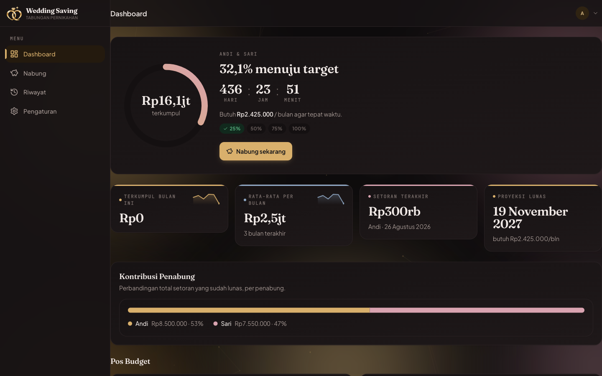
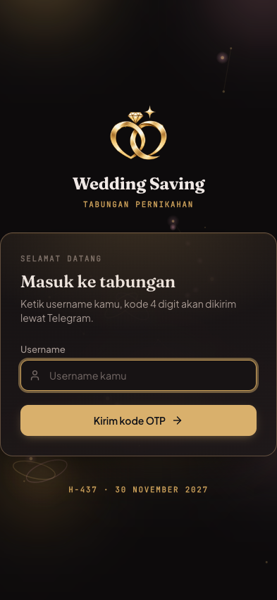
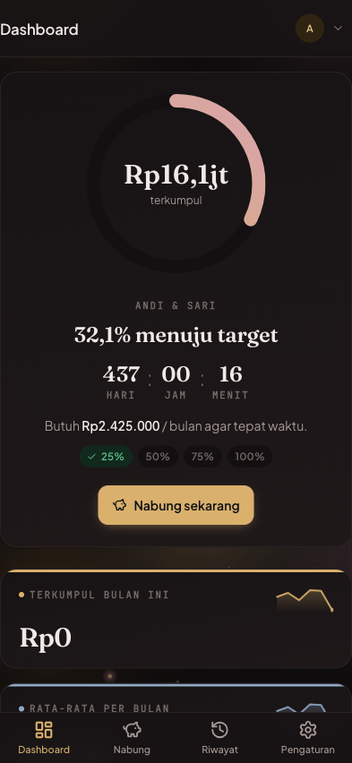
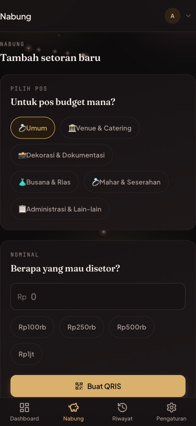

<div align="center">


# Wedding Saving Dashboard

Dashboard tabungan pernikahan untuk dua orang — setiap setoran QRIS terverifikasi otomatis, tidak ada yang dicatat manual.

[](https://weddingsaving.my.id)
[](https://demo.weddingsaving.my.id)


</div>

---

## Tentang

Dua orang menabung bersama menuju hari pernikahan mereka, 30 November 2027, dengan target Rp50.000.000. Masalahnya sederhana tapi nyata di hampir setiap tabungan bersama: sudah terkumpul berapa, siapa menyetor apa, dan apakah lajunya cukup untuk sampai di tanggal itu — tanpa salah satu pihak harus percaya begitu saja pada laporan manual pihak lain.

Wedding Saving Dashboard menjawab itu dengan membuat setiap setoran nyata. Uangnya benar-benar berpindah lewat QRIS, diverifikasi ke penyedia pembayaran, dan langsung mengubah angka di dashboard — bukan angka yang diketik ke catatan atau spreadsheet setelah transfer bank selesai dan gampang terlewat.

---

## Coba sendiri

Ini alat pribadi untuk dua akun tetap (lihat bagian [Kode sumber](#kode-sumber)), tapi cara kerjanya bisa dijelajahi langsung tanpa akun apa pun.

**Demo — [demo.weddingsaving.my.id](https://demo.weddingsaving.my.id)**
Satu tombol, tanpa pendaftaran, tanpa OTP sungguhan yang perlu diterima siapa pun. Demo berjalan di atas basis data yang terpisah total dari data asli, diisi data contoh (nama Andi & Sari yang muncul di tangkapan layar di bawah), sehingga aman dijelajahi — masuk, buka dashboard, buat kode QRIS — tanpa pernah menyentuh tabungan sungguhan.

**Situs penjelasan — [weddingsaving.my.id](https://weddingsaving.my.id)**
Halaman publik yang menjelaskan aplikasi ini untuk pengunjung yang belum tahu konteksnya: apa ini, untuk siapa, dan bagaimana alur pembayarannya bekerja.

---

## Tangkapan layar

### Dashboard (desktop)

<p align="center">
  
</p>

Ring progres, hitung mundur ke tanggal pernikahan, kebutuhan setoran bulan ini, proyeksi tanggal lunas, dan pembagian kontribusi antara dua penabung — semuanya dalam satu layar.

### Masuk, dashboard, dan menabung (mobile)

<table align="center">
<tr>
<td align="center" width="260"></td>
<td align="center" width="260"></td>
<td align="center" width="260"></td>
</tr>
<tr>
<td align="center">Masuk hanya dengan username; kode OTP menyusul lewat Telegram.</td>
<td align="center">Ring progres yang sama persis dengan versi desktop, disusun ulang untuk layar sempit.</td>
<td align="center">Pilih pos anggaran, isi nominal, buat kode QRIS.</td>
</tr>
</table>

*Nama dan nominal pada tangkapan layar di atas adalah data contoh dari instans demo (Andi & Sari), bukan data pemilik aplikasi yang sesungguhnya.*

---

## Fitur

- **Tahu persis apakah tabungan kalian on-track** — ring progres, H- ke tanggal pernikahan, dan kebutuhan setoran per bulan dihitung ulang setiap saat, bukan sekali di awal.
- **Tidak perlu percaya laporan manual siapa pun** — setiap setoran diverifikasi balik ke penyedia pembayaran sebelum saldo berubah; tidak ada angka yang masuk hanya karena seseorang bilang "sudah bayar".
- **Tahu siapa menyumbang berapa tanpa harus bertanya** — kontribusi dua penabung tampil berdampingan, bukan tersembunyi di riwayat.
- **Uang punya tempat, bukan satu angka besar** — target dipecah ke pos anggaran (venue, dekorasi, busana, dan seterusnya), masing-masing dengan progresnya sendiri.
- **Tidak ada kata sandi untuk diingat atau dilupakan** — cukup username, kode masuk mendarat di Telegram dalam hitungan detik.
- **Bisa dipantau dari chat, tapi tidak bisa menciptakan uang dari sana** — bot Telegram menampilkan saldo, riwayat, dan target, serta mengirim notifikasi dan pengingat; ia tidak bisa membuat transaksi, menerbitkan kode QRIS, atau memproses pembayaran apa pun. Setiap transaksi selalu lahir dari web.
- **Tidak pernah kelewat, tidak pernah dobel** — notifikasi otomatis setiap setoran lunas dan setiap kali melewati 25/50/75/100% dari target, terkirim tepat sekali.
- **Nyaman dipakai dari ponsel di mana pun** — tampilan dan animasi menyesuaikan diri di layar kecil, dan berhenti total begitu perangkat meminta gerakan lebih sedikit.

---

## Arsitektur

```
   Browser (Vue SPA) ───────┐
                             │
   Telegram (webhook bot) ──┼───►  Cloudflare Worker (Hono)  ───►  D1 (SQLite)
                             │                  ▲
   Penyedia QRIS (webhook) ──┘                  │
                                                 │
                              Cron terjadwal ────┘
                              (harian, dini hari WIB)
```

Satu Worker menangani seluruh permukaan aplikasi: melayani aset statis SPA, menjawab seluruh API yang dipakai dashboard, menerima dua webhook eksternal (Telegram dan penyedia pembayaran), dan menjalankan tugas terjadwal harian (menandai kode QRIS yang kedaluwarsa, mengirim ringkasan bulanan). Semuanya bicara ke satu D1 yang sama, tanpa lapisan cache atau antrian tambahan — volumenya (dua pengguna tetap, beberapa setoran per bulan) tidak pernah mendekati titik di mana lapisan seperti itu dibutuhkan.

**Kenapa satu Worker, bukan beberapa layanan.** Webhook pembayaran dan webhook bot Telegram sama-sama mensyaratkan endpoint HTTPS publik yang stabil, dan D1 hanya bisa diikat ke satu Worker tertentu — tidak bisa dibagi lintas proyek. Memecah SPA, API, dan penerima webhook ke layanan-layanan terpisah hanya menambah satu domain ekstra untuk diurus, satu pipeline deploy ekstra, dan satu sumber masalah CORS baru, tanpa keuntungan nyata untuk aplikasi dengan dua pengguna tetap. Kesederhanaan di sini bukan jalan pintas; ukurannya memang disesuaikan dengan skala masalahnya.

---

## Keamanan — cara berpikirnya

Aplikasi ini memindahkan uang sungguhan. Tabel di bawah adalah ringkasannya; tiga bagian sesudahnya menjelaskan alasan di balik keputusan yang paling sering dipertanyakan.

| Risiko | Mitigasi |
|---|---|
| Webhook pembayaran tidak ditandatangani sama sekali | Path webhook memuat token acak, dan setiap notifikasi yang masuk diverifikasi balik ke API transaksi resmi penyedia sebelum saldo bertambah |
| Webhook Telegram dipalsukan | Wajib header secret yang dipasang saat pendaftaran webhook; yang tidak cocok dijawab 401 tanpa keterangan |
| OTP 4 digit ditebak paksa | Hangus permanen setelah 5 kali salah, berlaku 5 menit, satu permintaan kode per 60 detik per username |
| Username ditebak di layar masuk | Respons selalu identik, ada atau tidak ada usernya; kode tetap hanya pernah mendarat di Telegram pemiliknya |
| Isi tabel sesi bocor | Yang tersimpan hanya hash satu arah dari token sesi, bukan token itu sendiri |
| Setoran tercatat dobel akibat webhook yang datang berulang | ID transaksi unik per setoran, dan transisi status hanya satu arah (menunggu → lunas) |
| Notifikasi terkirim berkali-kali untuk kejadian yang sama | Setiap pengiriman diklaim lewat entri unik di log; hanya pengklaim pertama yang benar-benar mengirim |
| Satu pihak mencairkan dana tanpa sepengetahuan pihak lain | Pemisahan kewenangan — akun pembayaran dan rekening tujuan pencairan dipegang dua orang berbeda |
| Bot Telegram disalahgunakan untuk memulai transaksi | Kemampuan membuat transaksi sengaja tidak ada di kode bot — hanya web yang bisa memulainya, dan ini komitmen tertulis ke penyedia pembayaran, bukan sekadar konvensi internal |
| Kredensial ikut ter-commit ke riwayat kode | Seluruh berkas rahasia dikunci lewat pengabaian git; nilai sungguhan hanya hidup di secret store platform |

**Webhook yang tidak pernah dipercaya begitu saja.** Penyedia pembayaran mengirim notifikasi lunas tanpa tanda tangan kriptografis apa pun — payload-nya JSON polos yang bentuknya bisa ditiru siapa saja yang menemukan URL-nya. Karena itu klaim dari webhook tidak pernah langsung dipakai. Begitu notifikasi masuk, sistem balik bertanya ke API transaksi milik penyedia itu sendiri, dan baris setoran di database hanya berubah kalau statusnya saat ini masih menunggu dan nominalnya cocok persis dengan yang tersimpan. Webhook yang sama yang mendarat dua kali — hal yang lumrah pada webhook apa pun — tidak pernah menambah saldo dua kali, karena begitu status berubah dari menunggu ke lunas, kedatangan berikutnya tidak lagi menemukan baris yang bisa diperbarui.

**Kenapa OTP 4 digit tetap masuk akal.** Empat digit hanya 10.000 kombinasi — dibiarkan ditebak bebas, itu lemah. Yang membuatnya aman bukan panjang kodenya, tapi tiga batasan yang berjalan bersamaan: kode hangus permanen setelah percobaan kelima yang salah (bukan sekadar menolak percobaan itu saja, tapi mematikan kodenya untuk selamanya), sehingga peluang menembus lewat tebakan acak adalah 5 dari 10.000; kode berlaku paling lama 5 menit; dan permintaan kode baru dibatasi satu kali per 60 detik untuk username yang sama. Faktor yang paling menentukan justru bukan matematika itu — kode selalu dikirim ke chat Telegram yang sudah terikat ke akun itu sejak awal. Orang luar yang berhasil menebak username yang benar tetap tidak pernah melihat kodenya; kode itu mendarat di ponsel pemiliknya, bukan di layar penebak.

**Pemisahan kewenangan.** Satu orang memegang akun penyedia pembayaran (bisa membuat transaksi, melihat saldo yang mengendap), orang lain memegang rekening bank tujuan setiap pencairan. Tidak ada satu pihak pun yang memegang keduanya sekaligus, jadi tidak ada satu pihak pun yang bisa membuat transaksi sekaligus mencairkan dananya sendirian — pencairan sepihak secara struktural tidak mungkin, bukan sekadar dilarang lewat kebijakan. Setiap setoran juga tercatat atas nama penyetornya dan memicu notifikasi ke kedua akun secara otomatis, jadi tidak ada setoran yang terjadi tanpa diketahui pihak lain.

---

## Keputusan teknis

**Uang disimpan sebagai `INTEGER` rupiah penuh, bukan desimal.** Rupiah tidak punya sen dalam praktik sehari-hari, jadi tidak ada alasan menaruh angka tabungan di belakang representasi floating-point mana pun. Setiap operasi pada jalur uang — menjumlah, membandingkan, memverifikasi nominal webhook — bekerja di atas bilangan bulat, sehingga galat pembulatan yang khas pada float tidak punya kesempatan muncul sama sekali.

**Stempel waktu yang menentukan logika ditulis dari JavaScript sebagai ISO-8601, bukan dibiarkan memakai fungsi tanggal bawaan SQLite.** Dua sumber itu menghasilkan format yang berbeda dan tidak bisa dibandingkan begitu saja sebagai string. Kolom yang sekadar catatan (kapan sebuah baris dibuat) boleh memakai default bawaan basis data, tapi kolom yang dipakai untuk keputusan — kedaluwarsa OTP, kedaluwarsa sesi — ditulis eksplisit dari kode aplikasi, supaya seluruh perbandingan waktu memakai format yang sama persis. Mencampur keduanya tidak menghasilkan error yang kelihatan; hasilnya kode yang kedaluwarsa terlalu cepat atau tidak pernah kedaluwarsa sama sekali, dan itu jenis bug yang baru ketahuan setelah dipakai orang sungguhan.

**Demo berjalan di atas basis data yang benar-benar terpisah, bukan filter di atas data asli.** Filter bisa salah tulis — satu kondisi query yang keliru dan data asli ikut terekspos. Basis data yang kosong tidak bisa salah dengan cara itu; batasnya bukan logika yang bisa punya bug, tapi keberadaan datanya sendiri.

**Command engine bot ditulis murni: menerima pesan masuk, mengembalikan daftar aksi, tidak mengirim apa pun sendiri.** Bagian yang benar-benar mengirim balasan ke Telegram adalah lapisan terpisah yang memanggil command engine ini. Karena keduanya dipisah, seluruh logika perintah bisa diuji tanpa jaringan sama sekali, dan bila suatu saat bot perlu pindah host, hanya lapisan pengirimnya yang perlu ditulis ulang — bukan logika perintahnya.

---

## Tech stack

| Bagian | Teknologi | Versi |
|---|---|---|
| Frontend | Vue | ^3.5.43 |
| Frontend | Vue Router | ^5.3.1 |
| Frontend | Pinia | ^4.0.3 |
| Frontend | @vueuse/core | ^15.0.0 |
| Frontend | lucide-vue-next | ^1.0.0 |
| Frontend | qrcode | ^1.5.4 |
| Build & styling | Vite | ^8.3.0 |
| Build & styling | Tailwind CSS | ^4.3.3 |
| Build & styling | @tailwindcss/vite | ^4.3.3 |
| Build & styling | @vitejs/plugin-vue | ^6.0.9 |
| Backend | Hono | ^4.13.8 |
| Backend | Cloudflare Workers | runtime |
| Backend | Cloudflare D1 (SQLite) | runtime |
| Backend | Wrangler | ^4.135.0 |
| Pengujian | Vitest | ^4.1.11 |
| Pengujian | @cloudflare/vitest-pool-workers | ^0.22.0 |
| Pengujian | @vue/test-utils | ^2.5.1 |
| Pengujian | jsdom | ^30.1.0 |
| Font | Fraunces Variable | ^5.3.0 |
| Font | Plus Jakarta Sans Variable | ^5.3.0 |
| Font | JetBrains Mono | ^5.3.0 |

---

## Pengujian

Lebih dari 190 tes otomatis, ditulis mengikuti TDD — tes lebih dulu, dipastikan gagal, baru implementasinya — tersebar di dua bagian:

- **Worker** — Vitest dengan `@cloudflare/vitest-pool-workers`, berjalan di atas D1 sungguhan lewat Miniflare dan migrasi skema yang sama seperti produksi. Panggilan keluar ke penyedia pembayaran dan Telegram di-stub di titik batas paling luar, bukan di tengah logika.
- **Frontend** — Vitest dengan `@vue/test-utils`, mencakup util pemformatan, util progres, store, dan komponen input OTP.

Tiga kelompok tes yang paling banyak menyita waktu justru bukan yang paling terlihat: memastikan webhook pembayaran yang sama datang dua kali tidak pernah menambah saldo dua kali, memastikan percobaan OTP keenam tetap ditolak walaupun kodenya benar, dan memastikan matematika kebutuhan setoran bulanan tetap masuk akal di kasus tepi — laju setoran nol, sisa bulan tinggal satu, target yang sudah lewat tercapai.

---

## Kode sumber

Kode sumber bersifat privat. Untuk akses atau untuk mendiskusikan pekerjaan serupa, hubungi ksatriabintangsamudra2022@gmail.com.

---

## Lisensi

Dirilis di bawah lisensi MIT — lihat berkas [LICENSE](LICENSE).

<div align="center">

© 2026 Ksatria Bintang Samudra

</div>
